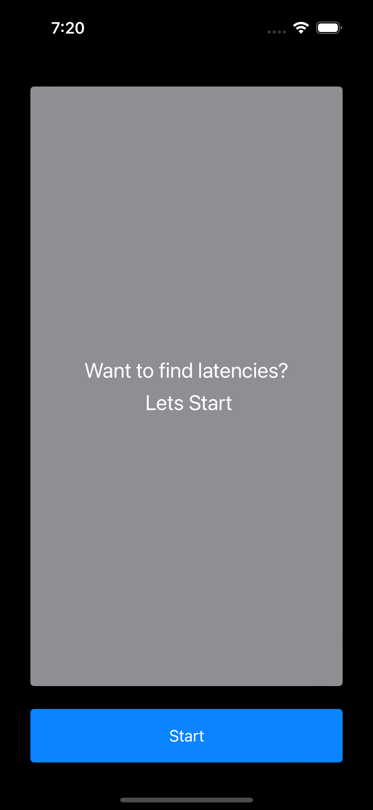
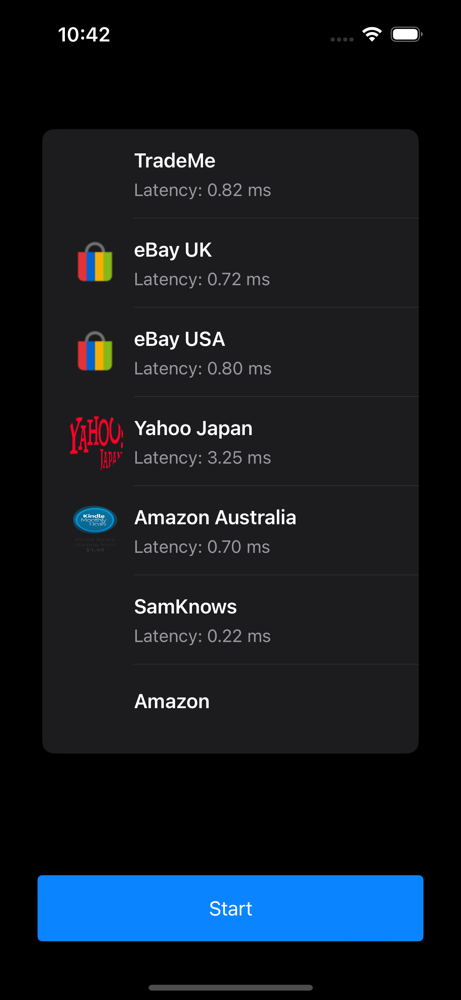

# PingFramework

## Overview
PingFramework is a Swift-based framework module designed to handle network latency measurement and host availability checks. It provides an easy-to-use API to ping remote hosts and track network performance, ideal for applications that require real-time or historical network monitoring.

## Screenshots

<p>
  
  
</p>

```
MyProject/
│
├── README.md
├── Readme-Assets/
│   ├── Ping1.png
│   └── Ping2.png

```

## Features

- Ping multiple hosts to measure network latency.
- Calculate network latency and load the thumbnail url.
- Simple API to integrate into iOS app.
- Consumable by both Swift and Objective-C based applications
- Provided a mvvm based swiftui sample application for reference


## Networking

The `NetworkManager` class handles all networking tasks, including fetching images and pinging the host address. It supports:

- **Completion Handlers**: Allows you to execute a network request and handle the result asynchronously.
- **Async-Await**: Provides a modern approach to asynchronous programming, making the code more readable.

## Tech Stack

**Client:** Swift 5, iOS 15.0 onwards

### Prerequisites

- Xcode 13 or later
- iOS 15.0 or later

### Installation

Clone the repository:
   ```bash
   git clone https://github.com/yourusername/PingFramework.git
   cd PingFramework
   ```
   
   ```
   Build and run the project:
   Select your target device or simulator in Xcode, and hit Cmd + R to build and run the project.
   ```
